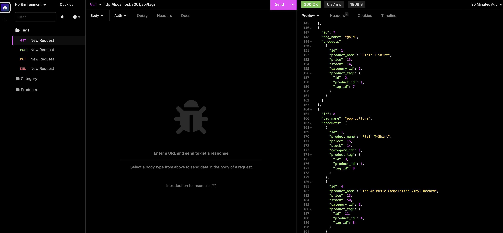

# e-commerce
A back end for an e-commerce site

## Description

This app is a back end for an e-commerce site. This app is built using Express.js, MySQL, and Sequelize.

## Table of Content

- [Installation](#installation)
- [Usage](#usage)
- [Link](#link)
- [Preview](#preview)
- [License](#license)
- [Contributing](#contributing)
- [Questions and Issues](#questions-and-issues)

## Installation

To install this app, download the file folder or clone the repo in your preferred directory.

## Usage

Using the comand line in your terminal, navigate into e-commerce/Develp directory. run "mysql" command, and log in with your credentials. 
Then run the "db/schema.sql" command to read the database from the schama.sql file. Quit mysql. 
Run "npm run seed" command to run the seeds.js files, and then "npm start" to start the server. 
Open the Insomnia app, to test the code. For more guide, please follow the walk-through demo below.

## Link

[Demo](https://drive.google.com/file/d/1pBlMfr9vsnU1lTAdSuKjtBR-qdlx_6uK/view)

## Preview

## License

This application is covered under [MIT License](https://choosealicense.com/licenses/mit/)

## Contributing

All users, feel free to contribute to this projec.

### GitHub account

[Nestor Montanez](https://github.com/nuno0123)

### Email me

[Nestor Montanez](mailto:Nuno0123@me.com)